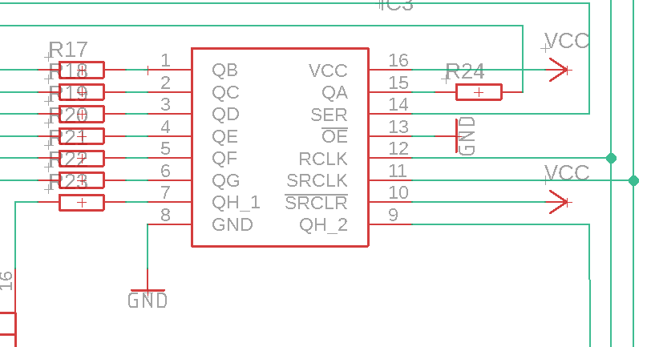
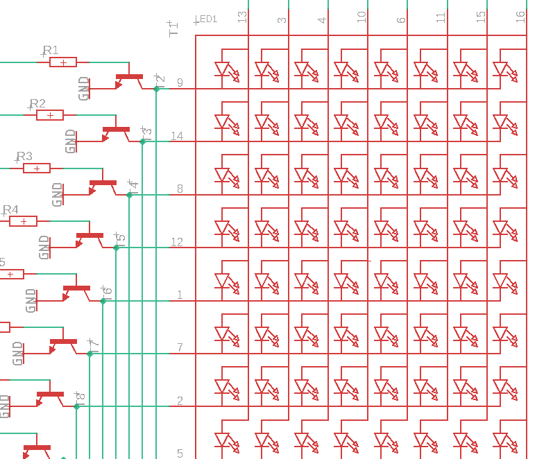

>>>


----

# Electronic game console

by: *Tangat Baktybergen*


**Faculty of Technology and Bionics**

***Rhine-Waal University of Applied Sciences***

Date: 9 January 2023

----

## Abstract

The goal of our project is to create a simple handheld gaming device (Gameboy) using dot matrix as a display which can be operated with some control buttons.

The components are used to create this device: [Apendix 3]

- 2 8x8 dot matrix displays
- 3 shift registers (SN74HC595N)
- 1 ATMega328p microcontroller unit
- 5 push buttons
- 1 active buzzer

Among these 5 action buttons, 4 buttons used for movements (Up, Down, Right, Left) and an event button (Start, Reset). The buzzer produces sound during the game.


## Table of Contents

[[_TOC_]]

## 1 Introduction

Game Boy is an 8-bit handheld gaming console. The console features  dot-matrix screen with adjustable contrast, five game control buttons (four directional buttons and "START" / "SELECT"), a single speaker and uses microcontroller as physical media for games. The color scheme is made from two tones. Due to the complexity of controling the matrix display , a simple "Simon Says" game is implemented for a demonstration purpose. [5]

### 1.1	Background

The Game Boy game console developed and manufactured by Nintendo. It was first released in Japan on April 21, 1989, in North America later the same year, and in Europe in late 1990. It was designed by the same team that developed the Game & Watch series of handheld electronic games and several Nintendo Entertainment System (NES) games: Satoru Okada, Gunpei Yokoi, and Nintendo Research & Development 1. [1]

The original internal code name for the Game Boy is Dot Matrix Game, referring to its dot-matrix display in contrast to the preceding Game & Watch series (which Yokoi had created in 1980) that has segmented LCDs pre-printed with an overlay, limiting each model to only play one game. The initials DMG came to be featured on the final product's model number: "DMG-01".The game was ultimately bundled with the Game Boy and the system was released in Japan in April 1989, North America in July, and in Europe in September the following year. Nintendo had spent $10 million on marketing the Game Boy. [1]


## 2	Literature review

On March 20, 1995, Nintendo released several special edition Game Boy models with colored cases, advertising them in the "Play It Loud!" campaign known in Japan as Game Boy Bros. Play It Loud! units were manufactured in red, green, black, yellow, white, blue, and clear (transparent), or sometimes called X-Ray in the UK. [1]

On July 21, 1996, Nintendo released the Game Boy Pocket for US$69.99: a smaller, lighter unit that required fewer batteries. It has space for two AAA batteries, which provide approximately 10 hours of gameplay. The unit is also fitted with a 3 volt, 2.35 mm x 0.75 mm DC jack which can be used to power the system. The Pocket has a smaller link port, which requires an adapter to link with the older Game Boy. [1]

A clear 'skeleton' Famitsu Model-F edition appeared in 1997, which had only 5,000 units released, and a clear yellow edition. [1]

The Game Boy Light was released on April 14, 1998, and only available in Japan. Like the Game Boy Pocket, the system was priced at ¥6,800. The Game Boy Light is slightly bigger than the Game Boy Pocket and features an electroluminescent backlight for low-light conditions. It uses two AA batteries, which give it approximately 12 gameplay hours with the light on and 20 with it off. [1]

## 3	Methodology

The display consists of 2 cathode-row 8x8 matrix which make 16 columns and 8 rows.[3]It is controlled with shift registers(Serial in Parallel out).One of the shift registers is used to send row data and the other two are in series for columns.Each shift register has 8 output pins. So, each shift register take only 8 row or 8 column control. [2]

Rows are combined into one shift register while columns have two separate shift registers in series. However,when all LEDs are lit , 8 LEDs simultaneously draw current from each output pin of the shift register.The shift register's output current is 35mA and 5mA for each output pin which is not enough.Consequently, 8 row NPN transistor were added to amplify the current at the output and reduce shift register's work load. [Appendix 2]

As mentioned before there are 5 buttons for control purpose. Buttons are connected to ground. Resistors were not used to save some space and they are pulled internally using programming. [Appendix 3]

The buzzer is simple tone generator as output device.

The microcontroller ATMega328p is implemented as in commonly used Arduino device. It has 16 MHz external clock, powered by 3 x AAA batteries which runs at 4.5 V within standards. Additional empty pins are added for furher programming of the MCU(microcontroller unit) without taking it from the pcb. The external connection pins are at RX/TX and MOSI/MISO/SCK/RESET as SPI connection. [Appendix 3]

Arduino IDE was chosen as a software development environment because we are using the base microcontroller of Arduino UNO.Arduino IDE supports C/C++ and can flash code to bare microcontrollers which makes it user friendly. [4]

"Simon Says" is a memory game. The matrix display shows random sequence of arrows (up,down,right and left) which the player must remember and repeat using 4 push buttons.

Game code overview:
1. Check if a new game is starting. If it is, generate random number sequence of 0 to 3 that points which arrow and button has to be pressed. Reset the round counter as it is a new game.
2. The number of rounds to play can be set manually. Each round the game will display arrows in a pattern, and then player has limited time to recreate the pattern by pressing corresponding control buttons.
3. The loop is used to display arrow patterns until the player reaches the winning round number or missclick of the button leads to restart of the game.

Creating random pattern of arrows:
```startSequence():
randomSeed(analogRead(A0));
for(int i=0;i<=3;i++){ // there are only 4 buttons in the pattern to choose
buttonSequence[i]=round(random(0,3));} 
```
Checking which button is pressed:
```buttonCheck():
if (digitalRead(button[0])== HIGH) { // if the button pressed return the index of arrow pattern to check
return 0;} else if(digitalRead(button[1])==HIGH) {
return1; 
...
else { return 4;} // 4 doesnot belong to array of pattern and means nothing 
}
```
An example of turning all LEDs on with shift registers:
```turnOnAll():
digitalWrite(latchPin, LOW); // enable latch pin to transfer data to column shift register
shiftOut(dataPin, clockPin, MSBFIRST, 255); // send 255 saying to turn on all LEDs on
digitalWrite(latchPin, HIGH); // disable latch pin stop sending data
digitalWrite(latchPin2, LOW); // enable latch pin to transfer data to row shift register
shiftOut(dataPin2, clockPin2, MSBFIRST, 0); // row is cathode so set to low
digitalWrite(latchPin2, HIGH); // disable latch pin stop sending data

```

## 4	Results
Presenting final result of our project:

The front picture of gameboy:


The bottom picture of gameboy:


## 5	Discussion

The project is successful.Matrix display works perfectly and games are also functionning as desired. All components are connected correctly and perform as it is supposed to.During the project , we also gained a lot of practical experience in the manufacturing of the PCB.It showed us that the design of the PCB should be precisely checked  and there is always a big room for improvement of both hardware and software to reach user friendly PCB design.


## 6	Concluding Comments

There are a lot of improvements can be done in the future. The main objective is to optimize software to control display. One of the ideas is to create a shift register library that can easily shift data to display. Another good objective is to implement a game card system using external microcontroller. This will allow player to change between games without programming the main controller every time. Finally, we would like to redesign the PCB to be more user friendly. For example, to put bigger push buttons and move them more to the center.

## 7	References

* [1] https://en.wikipedia.org/wiki/Game_Boy
* [2] http://1.bp.blogspot.com/-9f4dfwi-pJM/VBQ_4wqMJLI/AAAAAAAAYBQ/UQqTrODFz9U/s1600/paul%2B(13th%2Bcopy).png
* [3] https://leeselectronic.com/49304-large_default/led-dot-matrix-8x8-hs-1588ab-red.jpg
* [4] https://wolles-elektronikkiste.de/en/led-dot-matrix-display-control
* [5] https://en.wikipedia.org/wiki/Simon_Says


## 8	Appendices
    
Appendix 1: Example snapshot of shift register from the project schematic: 


Appendix 2: Example snapshot of 8x8 dot matrix and transistors connections from the project schemaatic:


Appendix 3: Table showing conections of ATMega328p I/O pins with other components.

| ATMega328p pin name | Connection 
|:---                 | ---:  
| 1. PC6              | Reset 
| 2. PD0              | RX   
| 3. PD1              | TX  
| 4. PD2              | Clock pin column SR      
| 5. PD3              | Latch pin column SR  
| 6. PD4              | Data pin column SR   
| 7. VCC              | VCC  
| 8. GND_1            | Ground      
| 9. PB6              | Crystal  
| 10. PB7             | Crystal 
| 11. PD5             | Clock pin row SR        
| 12. PD6             | Latch pin row SR   
| 13. PD7             | Data pin row SR  
| 14. PB0             | nothing    
| 15. PB1             | nothing   
| 16. PB2             | nothing  
| 17. PB3             | MOSI         
| 18. PB4             | MISO   
| 19. PB5             | SCK   
| 20. AVCC            | VCC       
| 21. AREF            | nothing  
| 22. GND_2           | Ground       
| 23. PC0             | button Right  
| 24. PC1             | button Down  
| 25. PC2             | button Left  
| 26. PC3             | button Event        
| 27. PC4             | button Up   
| 28. PC5             | Buzzer 


